# AREP-Taller-5
En este taller se tuvo como objetivo realizar un servidor web utilizando Spark y que respondiera a ciertas peticiones y tambien se subiera la imagen del contenedor a Docker

## Para ejecutar el programa

Se puede hacer uso del comando git clone y usar la URL del repositorio:
```
https://github.com/JuanPabloDaza/AREP-Taller-5
```

## Prerequisitos

Es necesario tener instalado maven para compilar y probar los test del programa, si no se tiene maven puede instalar [aqui](https://maven.apache.org/install.html).

## Instalacion 

Una vez clonado, se debe hacer uso del comando:

```
mvn package
```

Este comando compilara el programa y tambien ejecutara las pruebas. 

## Despliegue del programa:

Para ejecutar el programa se usa el comando:

```
java -cp "target/classes;target/dependency/*" edu.escuelaing.arep.app.SparkWebServer
```
Una vez ejecutado se debe acceder a traves de un buscador y con la direccion:
```
localhost:4567
```

## Descripcion del programa:

### Diseño:

En este programa se usa la clase SparkWebServer para realizar la implementacion de las respuestas a peticiones desde un cliente usando el framework Spark.

### Implementacion:

#### Desarrollo servidor:

Para comenzar se realizaron los metodos para responder a las diferentes implementaciones que se requerian:<br>

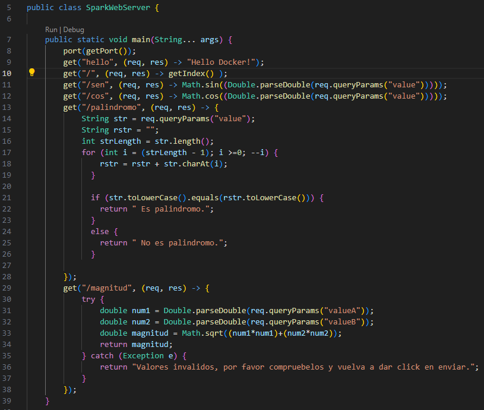<br>

El index del servidor es el siguiente:<br>

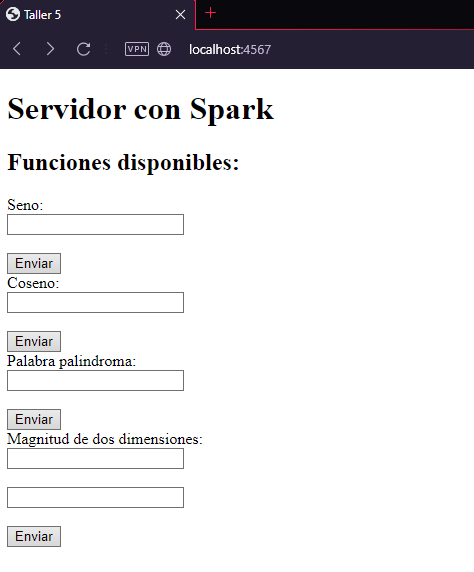<br>

Aqui podemos ver las cuatro implementaciones requeridas:

* Determinar el Seno de un valor.
* Determinar el Coseno de un valor.
* Determinar si una palabra es palindroma.
* Deteminar la magnitud de un vector real de dos dimensiones.

Aqui podemos ver las implementaciones funcionando:<br>

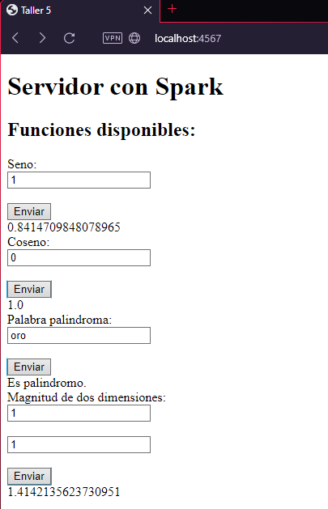<br>

#### Construccion de imagenes en Docker:

Para empezar se debe tener Docker Desktop instalado en el computador, y crearemos un archivo Dockerfile en la raiz del proyecto:<br>

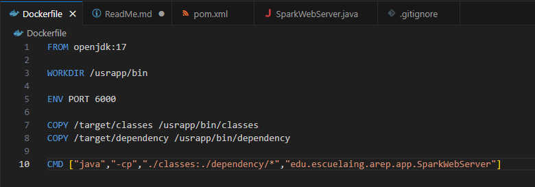<br>

Ahora utilizaremos el siguiente comando para construir la imagen:<br>

```
docker build --tag dockersparkprimer .
```

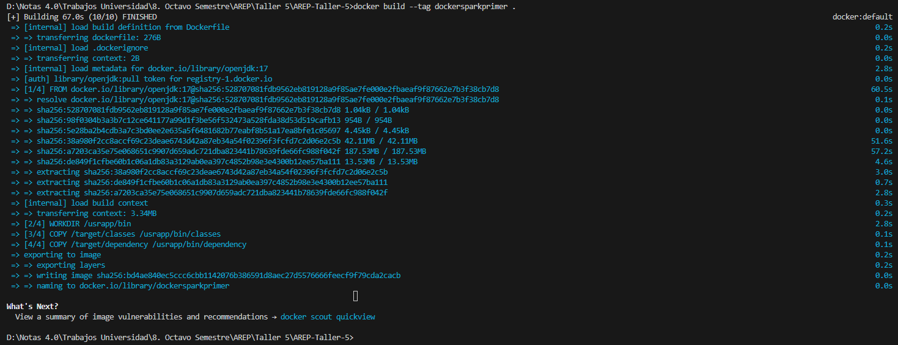<br>

Y ahora usando:

```
docker images
```

podemos ver las imagenes creadas:<br>

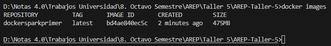<br>

Ahora crearemos tres contenedores usando:

```
docker run -d -p 34000:6000 --name firstdockercontainer dockersparkprimer
docker run -d -p 34001:6000 --name firstdockercontainer2 dockersparkprimer
docker run -d -p 34002:6000 --name firstdockercontainer3 dockersparkprimer
```

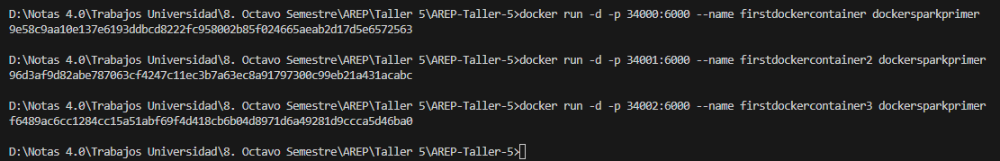<br>

Y usando el siguiente comando verificamos el estado de los contenedores:

```
docker ps
```

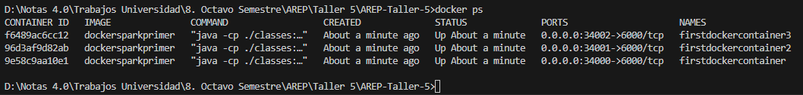<br>

Y ahora accedemos a la siguiente url y verificamos el estado de los contenedores:

```
localhost:34000
localhost:34001
localhost:34002
```

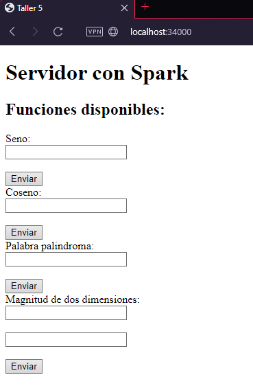<br>
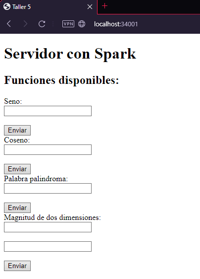<br>
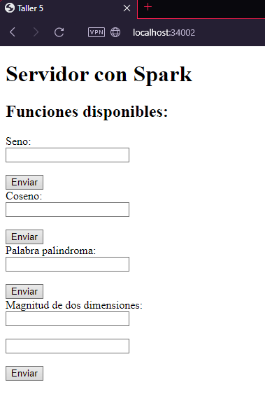<br>


Ahora crearemos un archivo docker-compose.yml en la raiz del directorio:<br>

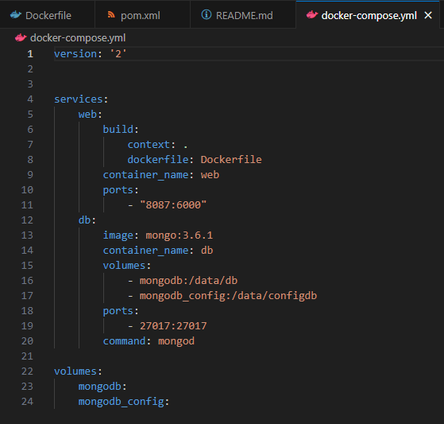<br>

Y ejecutamos el siguiente comando:

```
docker-compose up -d
```

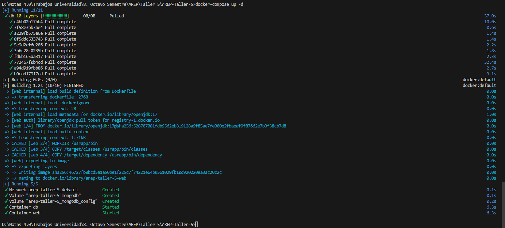<br>

Usando el siguiente comando verificamos los servicios:

```
docker ps
```

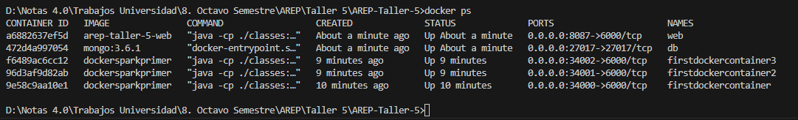<br>

Tambien podemos validar la creacion en la aplicacion Docker Desktop:

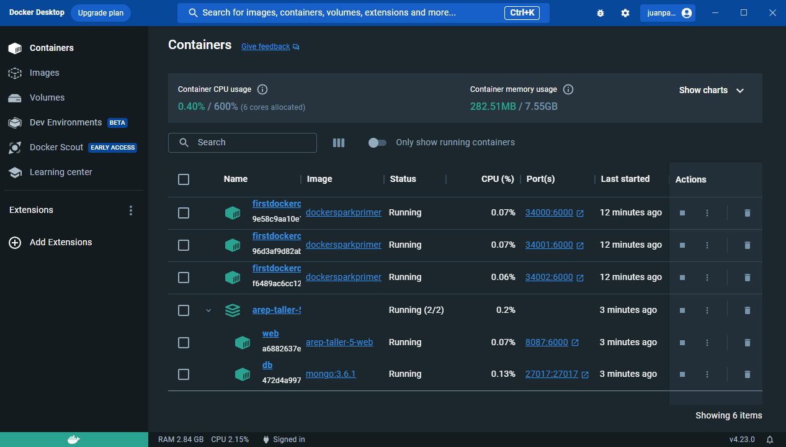<br>

Ahora subiremos la imagen a un repositorio en la web de [Docker](https://www.docker.com).<br>

Para empezar crearemos un repositorio:<br>

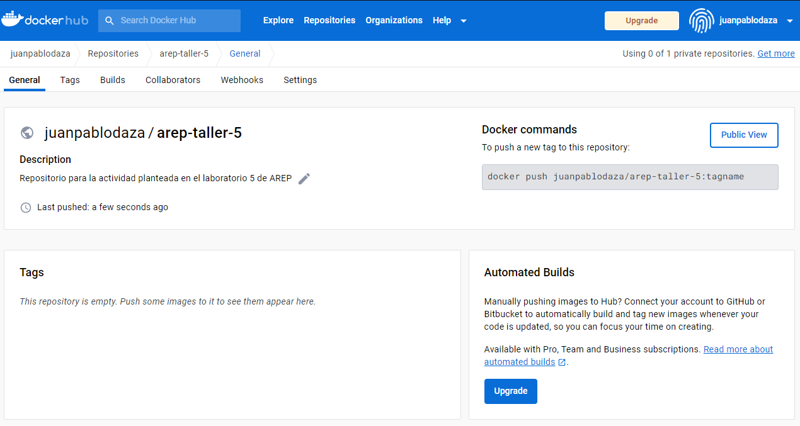<br>

Y ahora crearemos una referencia local de la imagen con el siguiente comando:

```
docker tag dockersparkprimer juanpablodaza/arep-taller-5
```

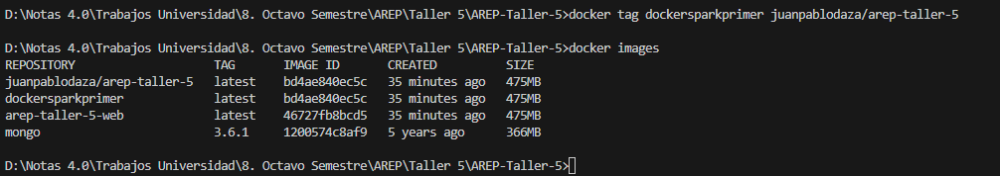<br>

Ahora nos autenticamos en nuestra cuenta de docker y subimos la imagen al repositorio:

```
docker push juanpablodaza/arep-taller-5:latest
```

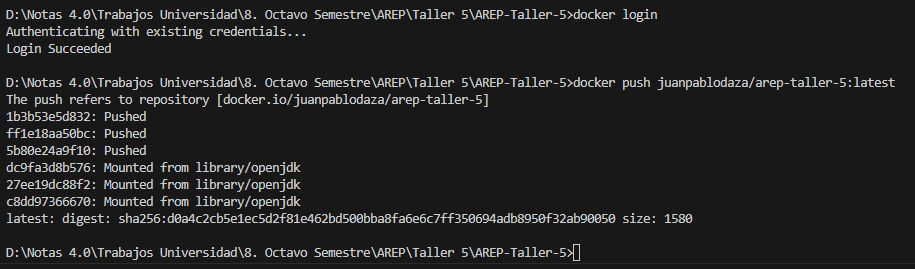<br>

Y ahora viendo el repositorio podemos ver la imagen:<br>

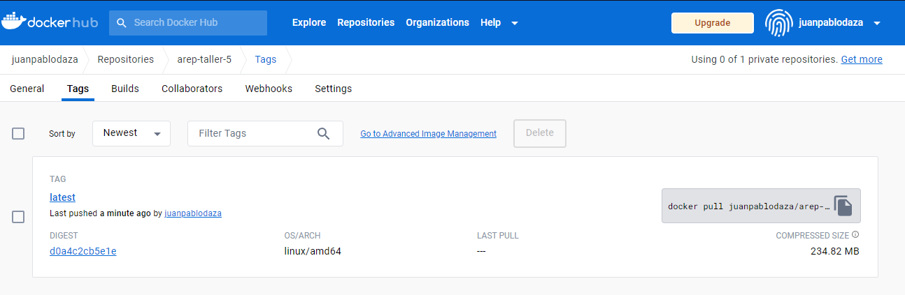<br>

El repositorio donde esta subida es:

```
https://hub.docker.com/repository/docker/juanpablodaza/arep-taller-5/general
```

Para correr la imagen podemos hacer el siguiente proceso:

1. Hacemos ```docker pull juanpablodaza/arep-taller-5:latest``` para descargar la imagen desde el repositorio.

2. Usamos ```docker ps``` para poder ver en que puerto esta escuchando el servidor:<br>

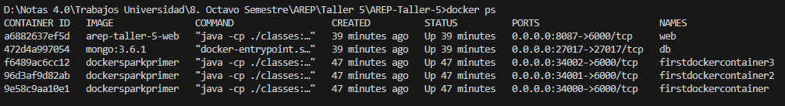<br>

3. Podemos ver que la imagen esta configurada para escuchar por el puerto 8087 y esta asignada al puerto 6000.

4. Usamos el comando ```docker run juanpablodaza/arep-taller-5``` y probamos la conexion:<br>

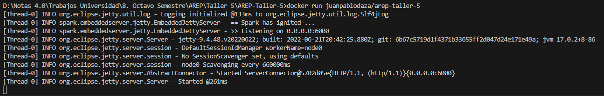<br>

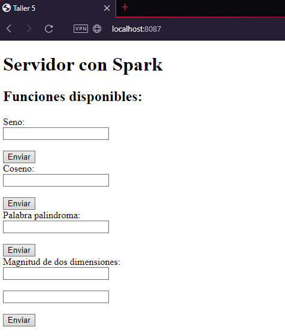<br>

5. Y asi logramos correr la imagen para probar la funcionalidad.


## Construido con:

* [Maven](https://maven.apache.org/) - Manejo de dependecias.

* [Docker](https://www.docker.com) - Creacion de imagenes.

## Autor

* Juan Pablo Daza Pinzón
