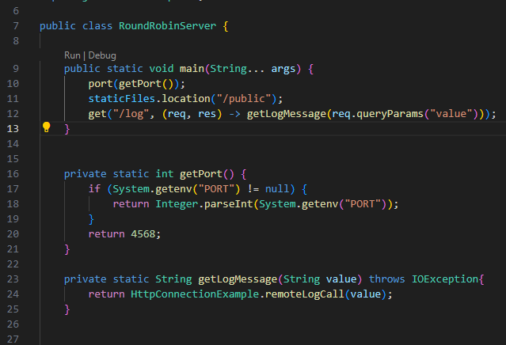
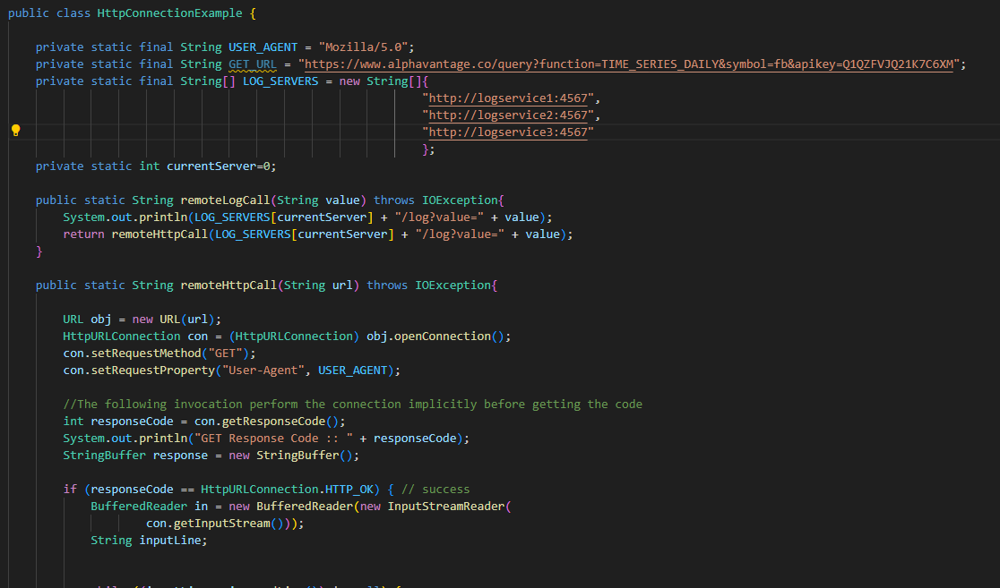
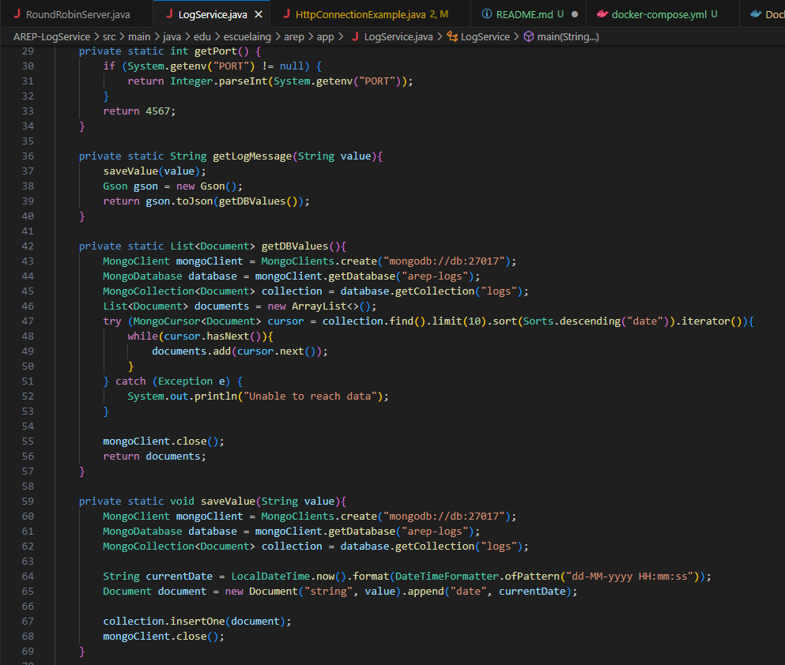
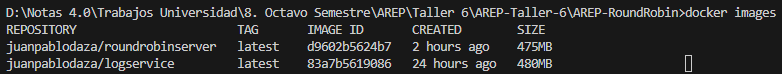
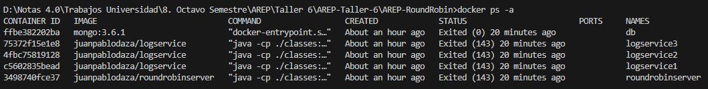
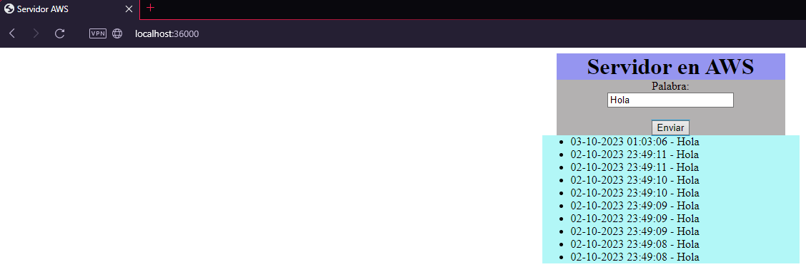
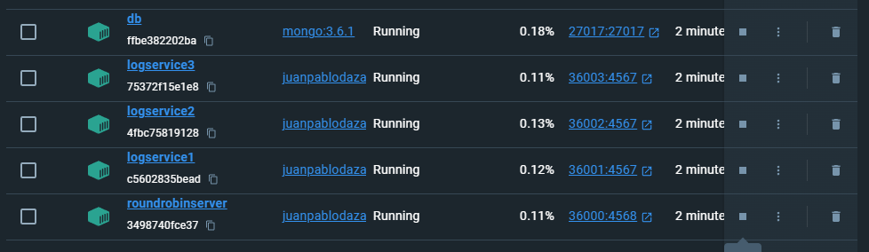
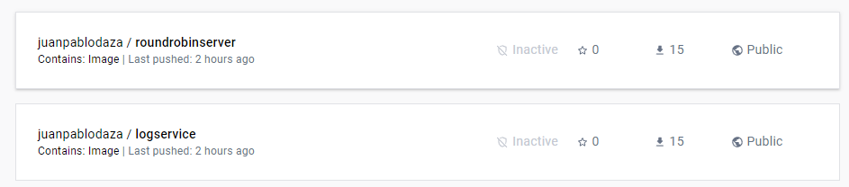

# AREP-Taller-6
En este taller se tuvo como objetivo realizar un servidor web utilizando Spark que implementara un algoritmo de balanceador de cargas para conectarse a 3 servicios distintos que escribian en una base de datos mongodb y retornaban las 10 ultimas cadenas almacenadas en la base de datos.

## Para ejecutar el programa

Se puede hacer uso del comando git clone y usar la URL del repositorio:
```
https://github.com/JuanPabloDaza/AREP-Taller-6
```
Luego lo recomendado es usar Docker para utilizar el archivo docker-compose.yml el cual ya contiene la configuracion optima para el uso del servidor.

## Prerequisitos

Es necesario tener instalado maven para compilar y probar los test del programa, si no se tiene maven puede instalar [aqui](https://maven.apache.org/install.html).

## Despliegue del programa:

Si se desea usar las imagenes de los servicios, entonces es recomendable usar los siguientes comandos de Docker para crear toda la arquitectura:

```
docker network create arep-taller6
```

```
docker run -d -p 36000:4568 --name roundrobinserver --network arep-taller6 juanpablodaza/roundrobinserver
```

```
docker run -d -p 36001:4567 --name logservice1 --network arep-taller6 juanpablodaza/logservice
```

```
docker run -d -p 36002:4567 --name logservice2 --network arep-taller6 juanpablodaza/logservice
```

```
docker run -d -p 36003:4567 --name logservice3 --network arep-taller6 juanpablodaza/logservice
```

```
docker run -d -p 27017:27017 -v mongodb:/data/db -v mongodb_config:/data/configdb --name db --network arep-taller6 mongo:3.6.1 mongod
```

Estos comandos escritos en orden crearan toda la estructura:

<br>


## Descripcion del programa:

### Diseño:

En este programa se usa la clase RoundRobinServer de la carpeta AREP-RoundRobin para realizar el manejo de las peticiones GET. Esta clase usa la clase HttpConnectionExample para realizar el llamado a los logservice y estos a su vez llaman a la base de datos para solicitar la informacion que se requiera.

### Implementacion:

#### Desarrollo servidor:

Para empezar tenemos la clase RounRobinServer.java que recibe las peticiones y retorna la pagina principal o utiliza la clase HttpConnectionExample.java para realizar las peticiones a alguno de los servicios.<br>

<br>

La clase HttpConcetionExample.java utiliza un algoritmo RoundRobin de balanceo de cargas:<br>

<br>

Esta clase se intentara conectar con uno de los servicios y acto seguido cambiara el siguiente servicio al que se conectara para hacer efectivo el algoritmo de balanceo de cargas.<br>

La clase LogService.java registra el valor recibido en la base de datos para luego llamar los ultimos 10 valores que hayan sido registrados:<br>

<br>


#### Construccion de imagenes en Docker:

Ahora utilizaremos el siguiente comando para construir la imagen:<br>

En AREP-RoundRobin:

```
docker build --tag juanpablodaza/roundrobinserver .
```

En AREP-LogService:

```
docker build --tag juanpablodaza/logservice .
```

Y ahora usando:

```
docker images
```

podemos ver las imagenes creadas:<br>

<br>

Para la creacion de los contenedores deben usarse los comandos anteriormente mencionados:

```
docker network create arep-taller6
```

```
docker run -d -p 36000:4568 --name roundrobinserver --network arep-taller6 juanpablodaza/roundrobinserver
```

```
docker run -d -p 36001:4567 --name logservice1 --network arep-taller6 juanpablodaza/logservice
```

```
docker run -d -p 36002:4567 --name logservice2 --network arep-taller6 juanpablodaza/logservice
```

```
docker run -d -p 36003:4567 --name logservice3 --network arep-taller6 juanpablodaza/logservice
```

```
docker run -d -p 27017:27017 -v mongodb:/data/db -v mongodb_config:/data/configdb --name db --network arep-taller6 mongo:3.6.1 mongod
```

Y usando el siguiente comando verificamos el estado de los contenedores:

```
docker ps -a
```

<br>

Y ahora accedemos a la siguiente url y verificamos el estado del contenedor del servidor RoundRobin:

```
http://localhost:36000
```

<br>


Tambien podemos validar la creacion en la aplicacion Docker Desktop:



Ahora subiremos la imagen a un repositorio en la web de [Docker](https://www.docker.com).<br>

Para empezar crearemos un repositorio para cada imagen, en este caso un se llamara "roundrobinserver" y el otro "logservice".<br>

Y ahora haremos push para subir las imagenes al repositorio:<br>

```
docker push juanpablodaza/roundrobinserver:latest
```

```
docker push juanpablodaza/logservice:latest
```

Y las podemos ver en Docker Hub:<br>

<br>

Los repositorios donde estan subidas son:

```
https://hub.docker.com/repository/docker/juanpablodaza/roundrobinserver/general
```

```
https://hub.docker.com/repository/docker/juanpablodaza/logservice/general
```

## Funcionamiento en AWS:

Se debe crear una instancia de EC2 en AWS e instalar Docker, luego realizar el mismo procedimiento del despliegue local que esta mas en el documento README.<br>

una vez se realice el correcto despliegue de las imagenes podemos acceder a la direccion de la instancia para comprobar el funcionamiento, el siguiente es un video donde se muestra el correcto funcionamiento en una isntancia EC2 de AWS:

* [Video funcionamiento](https://www.youtube.com/watch?v=vNhncjGQVac)

## Construido con:

* [Maven](https://maven.apache.org/) - Manejo de dependecias.

* [Docker](https://www.docker.com) - Creacion de imagenes.

## Autor

* Juan Pablo Daza Pinzón
